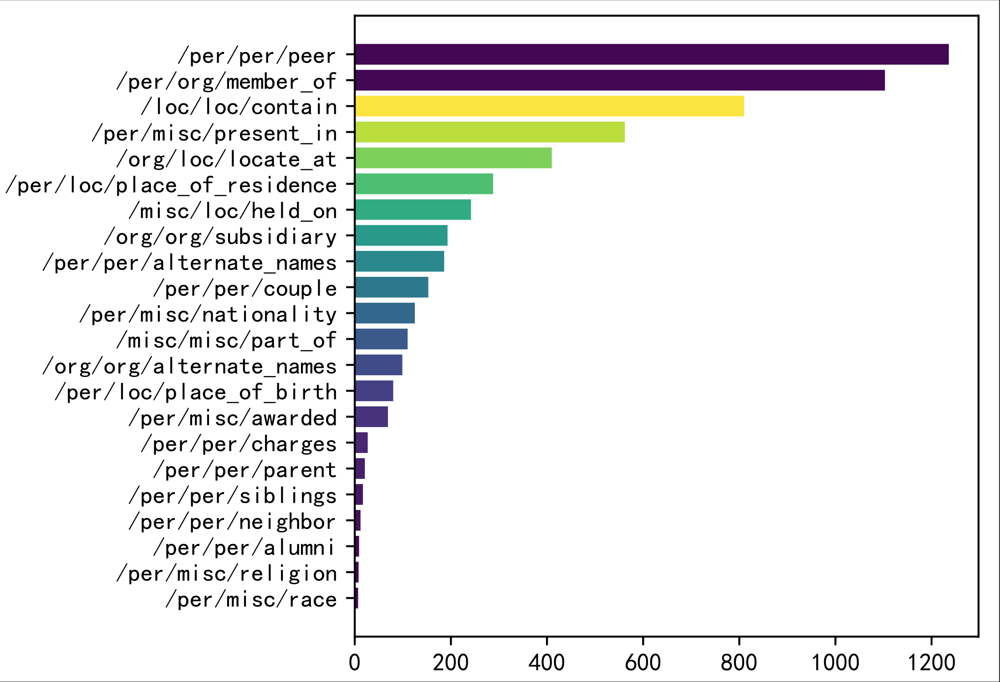
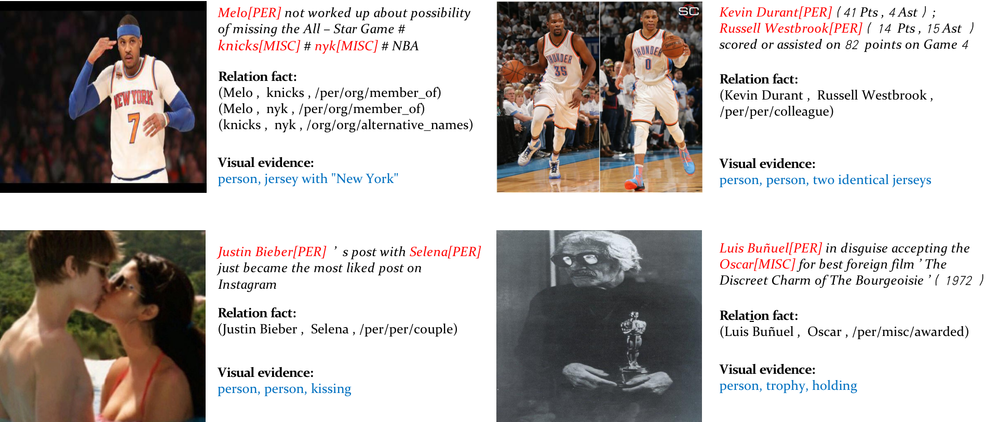

# MNRE
Resource and Code for ICME 2021 paper [MNRE: A Challenge Multimodal Dataset for Neural Relation Extraction with Visual Evidence in Social Media Posts](https://ieeexplore.ieee.org/abstract/document/9428274)

## Recent Updates
- [x] 2021.6.22 We provide MNRE-2, a refined version which merges several ambigious categories with much more support samples. The original version has moved to [Version-1](/Version-1/)

## Overview
This project aims to present a new task -- multimodal neural relation extraction and a dataset (MNRE) for model evaluation. The MNRE task requires a understanding of both vision and language. We envisage a range of well-designed methods and resources for such a challenge that would boost the development of multimodal alignment towards a higher semantic level.


This is an example of multimodal relation extraction in Twitter. There are three entities in this sentence: "JFK", "Obama" and "Harvard". The main task of relation extraction is to identify the relations of each entity pair. Previous works incorrectly classify the relations of "JFK" and "Harvard" as "Residence" and the "JFK" and "Obama" as "Spouse" due to the missing of contexts. However, we can know that "JFK" and "Harvard" are in the relation of "Graduated at" with the visual concepts "Bachelor cap" and "Gown". Still, the relations of "JFK" and "Obama" can be identified as "Alumni" with the guidance of all the visual objects about "Campus".

## Data Statistics

### Data Statistics Compared to Previous NRE Dataset

Dataset | # Image | # Word | # Sentence | # Entity | # Relation | # Instance
-- | -- | -- | -- | -- | -- | -- 
SemEval-2010 Task 8 | - | 205k | 10,717 | 21,434 | 9 | 8,853
ACE 2003-2004 | - | 297k | 12,783 | 46,108 | 24 | 16,771 
TACRED | - | 1,823k | 53,791 | 152,527 | 41 | 21,773
FewRel | - | 1,397k | 56,109 | 72,124 | 100 | 70,000 
MNRE | 9,201 | 258k | 9,201 | 30,970 | 23 | 15,485

This is the version 2 of our MNRE dataset. We refine and merge some categories for better understandings. The dataset contains 15,484 samples and 9,201 images with 23 relation categories. We split the dataset into training, development and testing set with 12247, 1624 and 1614 samples, respectively.


### Category Distribution



We start tagging relation types depending on the entity types. For example, the relations between one person and another person can be classified into ''alumni'', ''couple'' and ''relative'' et al.

## Data Collection

We build the original corpus from three sources: two available multimodal named entity recognition datasets - [Twitter15 and Twitter17](https://github.com/jefferyYu/UMT), and crawling data from [Twitter](https://archive.org/details/twitterstream).

We utilize a pretrained NER tagging tool [elmo](https://allennlp.org/elmo) for extracting both entities and their corresponding types.

## Data Usage

Our processed textual relations is in `./mnre_txt/`, the image data can be downloaded [here](https://drive.google.com/file/d/1FYiJFtRayWY32nRH0rdycYzIdDcMmDFR/view?usp=sharing). 

>Each sentence is split into several instances (depending on the number of relations).
>Each line contains
>```
>'token': Texts preprocessed by a tokenizer
>'h': Head entities and their positions in a sentence
>'t': Tail entities and their positions in a sentence
>'image_id': You can find the corresponding images using the link above
>'relation': The relations and entity categories
>```

## Case Study



Four examples for illustrating the effectiveness of visual information in extracting relations. The first line shows that the visual objects and their attributes can help in identifying relations. Further more, we show that the interactions of person-to-person or person-to-object can also provide clues for classifying relations.


## Citation
If you find this repo helpful, please cite the following:
```latex
@inproceedings{zheng2021mnre,
  title={MNRE: A Challenge Multimodal Dataset for Neural Relation Extraction with Visual Evidence in Social Media Posts},
  author={Zheng, Changmeng and Wu, Zhiwei and Feng, Junhao and Fu, Ze and Cai, Yi},
  booktitle={2021 IEEE International Conference on Multimedia and Expo (ICME)},
  pages={1--6},
  year={2021},
  organization={IEEE}
}
```
